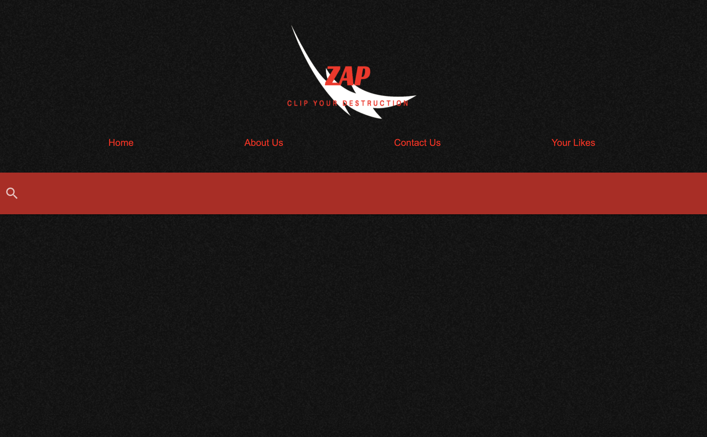

# zap

## Project Title

ZAP: GAME ON!

https://jamesrowe1.github.io/ZAP/

## Screenshot

## Getting Started

In the search bar fetch a game that you would like to know the price, ESRB rating, preview and availability of. Once the game is entered, the stats on show underneath a snapshot of the game. Not only is the stats there but also three buttons (share, like and preview).The share button allows user to share a link of their choosen game card and the preview gives the user a short video of the game. The like button saves the the game choice which is stored in the "Your Likes" tab (revisitable). There is a contact page for any of those with questions, comments or concerns. Lastly, the "About Us" page gives you a glimpse to the team members and their personalities.

## Prerequisites

You must have a working web browser.

## Built With

- Visual Studio Code
- HTML
- CSS
- JavaScript
- jQuery
- Materialized CSS
- Chrome
- Hosted by Github
- CheapStores API
- RawgResponse API
- CheapSharkDeals API

## Authors

James Rowe, Tanmay Sarker, Melissa Mercado, Umar Arshad and Tiffany Lombardi

## License

Licensed under Awesome Coders L.L.C. (not a real company but should be)

## Troubleshooting

For any issues contact any of the listed fabulous team members.

## Acknowledgments

- Ben Wright
- Justin Pinero
- Tutor(s):
- Ben Benson
- Wilson Linares
- The Project Group:
- Melissa Mercado
- Tanmay Sarker
- Tiffany Lombardi
- Umar Arshad
